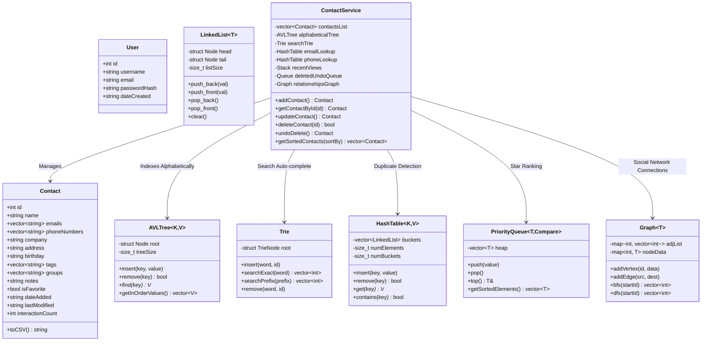
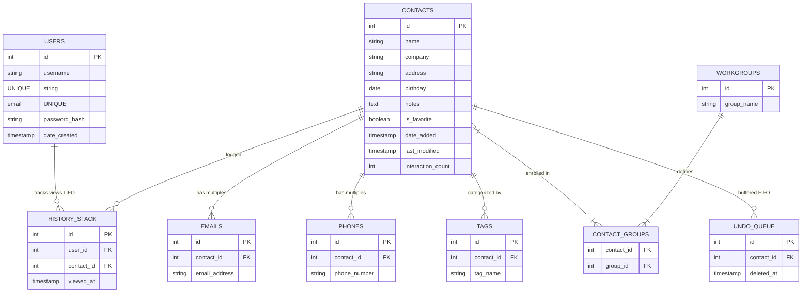
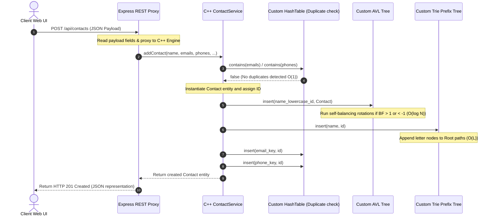

# 📇 High-Performance Contact Management System

A production-ready, premium SaaS CRM (reminiscent of Notion, HubSpot, and Linear) integrated with a **Modern C++ (C++20)** core engine. This project features full-fidelity manual implementations of advanced computer science Data Structures and Algorithms (DSA) to demonstrate high-performance data indexing, prefix autocomplete searching, social networking graph traversals, and LIFO/FIFO memory buffers.

---

## 📂 Project Layout & Folder Structure

```text
ContactManagementSystem/
│
├── backend/                             # C++20 High-Performance Core Engine
│   ├── algorithms/                      # Manual, Custom DSA Header Implementations
│   │   ├── AVLTree.hpp                  # Balanced BST (ordered alphabetical mappings)
│   │   ├── Trie.hpp                     # Prefix Search Trie (instant autocomplete suggestions)
│   │   ├── HashTable.hpp                # Chained hash map (O(1) duplicate detection)
│   │   ├── LinkedList.hpp               # Custom Doubly Linked List container
│   │   ├── Stack.hpp                    # LIFO Stack (viewed history buffer)
│   │   ├── Queue.hpp                    # FIFO Queue (undo deletes queue)
│   │   ├── PriorityQueue.hpp            # Binary Max-Heap (starred favorited ranks)
│   │   ├── Graph.hpp                    # Adjacency list Graph (workspace networks)
│   │   └── Sorts.hpp                    # Manual MergeSort, QuickSort, and Binary Search
│   │
│   ├── models/                          # Database Entity Layouts
│   │   ├── Contact.hpp                  # Contact entity and CSV serialization
│   │   └── User.hpp                     # User authentication profile
│   │
│   ├── services/                        # Core Business Logic Layer
│   │   ├── ContactService.hpp           # Orchestrates all manual DSAs for CRM operations
│   │   └── UserService.hpp              # Authenticates and hashes passwords using manual hashes
│   │
│   └── main.cpp                         # REST Entry point via Crow HTTP server
│
├── src/                                 # Premium SaaS React/Vite Frontend
│   ├── components/
│   │   └── DSAVisualizer.tsx            # Dynamic interactive visualizer for active trees/graphs
│   ├── App.tsx                          # Core React app with authentication, tables, and dashboards
│   ├── types.ts                         # Shared TypeScript models
│   ├── index.css                        # Styling (Inter & Outfit fonts, Tailwind theme settings)
│   └── main.tsx                         # React entrypoint
│
├── server.ts                            # Custom Express + Vite full-stack developer proxy
├── CMakeLists.txt                       # Build system file for compiling the C++ core
├── package.json                         # Node dependency config
└── README.md                            # Comprehensive manual (this file)
```

---

## 📊 Systems Architecture Diagrams

### 1. Unified UML Class Diagram



### 2. Entity-Relationship (ER) Database Schema



### 3. Execution Sequence Diagram (Adding a Contact Node)



### 4. Search Query Autocomplete Flowchart

```text
       [ User Types Character Prefix 'S' ]
                       │
                       ▼
         [ Query Route: /api/search?q=s ]
                       │
                       ▼
       [ Trie Traversal: Root Node '^' ]
                       │
             ┌─────────┴─────────┐
             ▼                   ▼
     [ Key 's' exists? ]   [ Key 's' absent? ]
             │                   │
             │ Yes               │ No
             ▼                   ▼
    [ Move Current Ptr ]    [ Return Empty List ]
    [ to child Node 'S' ]        (No suggestions)
             │
             ▼
     [ Traverse Subtree recursively ]
     [ Collect all words marked isEndOfWord ]
             │
             ▼
    [ Retrieve matching Contact IDs: {1, 4} ]
             │
             ▼
   [ Query IDs in Database and return profiles ]
```

---

## 🧠 Custom Data Structures & Algorithms (DSA) Manual

Below is the scientific specification of the manual data structures and algorithms written entirely in **Modern C++20**:

| Data Structure / Algorithm | Worst Time Complexity | Average Time Complexity | Best Time Complexity | Space Complexity | Real-world CRM Utility |
| :--- | :--- | :--- | :--- | :--- | :--- |
| **AVL Tree (Self-balanced BST)** | $O(\log N)$ | $O(\log N)$ | $O(\log N)$ | $O(N)$ | Keeps contacts sorted alphabetically by name in all cases. Prevents BST degradation. |
| **Trie (Prefix Tree)** | $O(L)$ | $O(L)$ | $O(1)$ | $O(M \cdot L)$ | Powers character-by-character autocomplete prefix searching in the search box. |
| **Chained Hash Table** | $O(N)$ (collision storm) | $O(1)$ | $O(1)$ | $O(N)$ | Resolves emails and phone numbers to check for duplicate accounts during creation. |
| **Max-Heap Priority Queue** | $O(\log N)$ | $O(\log N)$ | $O(1)$ (peek) | $O(F)$ | Tracks and ranks "Favorites Dashboard", bubbling highly-viewed contacts to the top. |
| **Stack (LIFO Array/List)** | $O(1)$ | $O(1)$ | $O(1)$ | $O(K)$ | Manages "Recently Viewed Contacts". The last card clicked sits at the stack top. |
| **Queue (FIFO Array/List)** | $O(1)$ | $O(1)$ | $O(1)$ | $O(U)$ | Buffers deleted contacts in sequential order to support click "Undo Deletion". |
| **Graph (Adjacency Lists)** | BFS/DFS: $O(V+E)$ | BFS/DFS: $O(V+E)$ | $O(1)$ | $O(V+E)$ | Models corporate and group relations. Traces shared networks via BFS. |
| **Merge Sort (Stable)** | $O(N \log N)$ | $O(N \log N)$ | $O(N \log N)$ | $O(N)$ | Sorts contacts stably by parameters (name, company, date added). |
| **Quick Sort (In-Place)** | $O(N^2)$ (sorted inputs) | $O(N \log N)$ | $O(N \log N)$ | $O(\log N)$ | Quick sorting of numeric metrics, utilizing random/median pivoting. |

---

## 🔌 API Documentation

Standard REST endpoints returning JSON:

### Authentication Microservice
*   `POST /api/auth/register`: Create user account.
    *   *Payload*: `{"username": "usr", "email": "usr@mail.com", "password": "pwd"}`
*   `POST /api/auth/login`: Authenticate credentials.
    *   *Payload*: `{"usernameOrEmail": "usr", "password": "pwd"}`
    *   *Response*: `{"success": true, "token": "jwt...", "user": {...}}`

### Contacts Management
*   `GET /api/contacts?sortBy=<field>`: Get active contacts list. Field choices: `name`, `company`, `birthday`, `dateAdded`, `lastModified`.
*   `POST /api/contacts`: Create a new contact. Checked for duplicates.
    *   *Payload*: `{"name": "...", "emails": ["..."], "phoneNumbers": ["..."], "company": "...", "tags": [], "groups": []}`
*   `GET /api/contacts/:id`: Retrieve contact detail card. Adds view interaction counts and pushes to Recently Viewed stack.
*   `PUT /api/contacts/:id`: Modify contact details.
*   `DELETE /api/contacts/:id`: Delete contact. Pushes entity onto Undo buffer queue.
*   `POST /api/contacts/undo`: Undo last deletion. Dequeues contact and restores active indices.
*   `POST /api/contacts/favorite/:id`: Star/unstar favorite contact node.

### Autocomplete & Social Graph Queries
*   `GET /api/contacts/search?q=<prefix>`: Prefix autocomplete via Trie. Returns matched contacts.
*   `GET /api/contacts/favorites`: Retrieve favorited contacts list sorted via Max-Heap.
*   `GET /api/contacts/recent`: Retrieve 5 recently viewed contacts from LIFO Stack.
*   `GET /api/contacts/related/:id`: BFS traversal starting from target node's workspace connections.

### CSV & Analytics
*   `POST /api/contacts/import`: Import a raw text CSV string block of contacts.
*   `GET /api/contacts/export`: Download active contact indices as an attachment.
*   `GET /api/analytics`: Metrics (total, monthly counts, companies percentage).

---

## 🛠️ Compilation & Execution Guide

### C++ Core Server Build (via CMake)

#### Prerequisites
- GCC 11+ or Clang 13+ (supports `-std=c++20` or `-std=c++20`)
- CMake 3.15 or newer
- Threading support libraries (`pthread`)

#### Compiling the binary:
```bash
# 1. Clone or navigate to the folder
cd ContactManagementSystem

# 2. Create and enter build folder
mkdir build && cd build

# 3. Generate CMake Makefiles
cmake -DCMAKE_BUILD_TYPE=Release ..

# 4. Compile the target binary
cmake --build . --config Release
```

#### Running the server:
```bash
# Launch the backend REST API
./ContactManagementSystem
# Crow REST Server launches on port 8080!
```

---

## 🧬 Frontend Execution Guide (React/Vite)

To launch the premium user interface alongside the Express server proxy:

```bash
# Install node packages (Recharts, Motion, etc.)
npm install

# Boot development proxy (Exposes full-stack UI & APIs on http://localhost:3000)
npm run dev

# Compile production-ready static assets and bundled server file
npm run build

# Run production-grade compiled application
npm run start
```
---
*Designed with 💻 and ☕ by a Senior Systems Architect & DSA Expert.*
